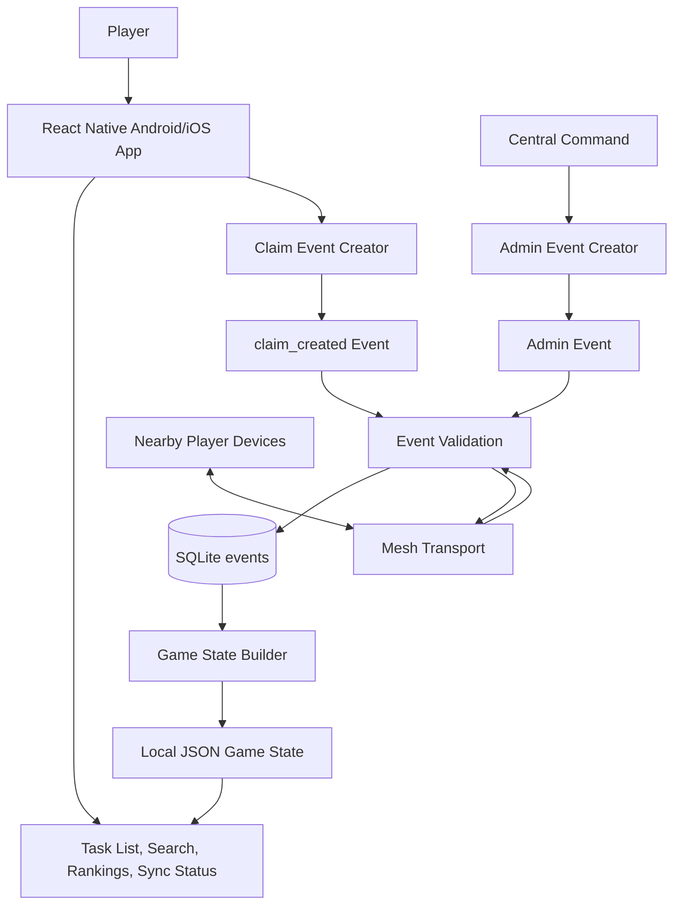
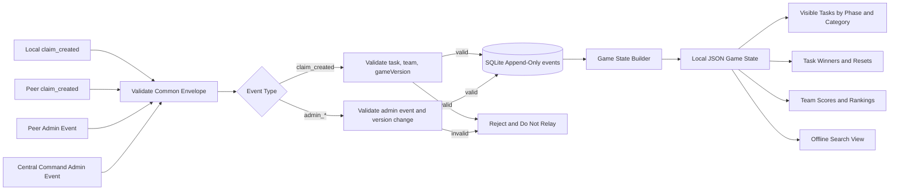
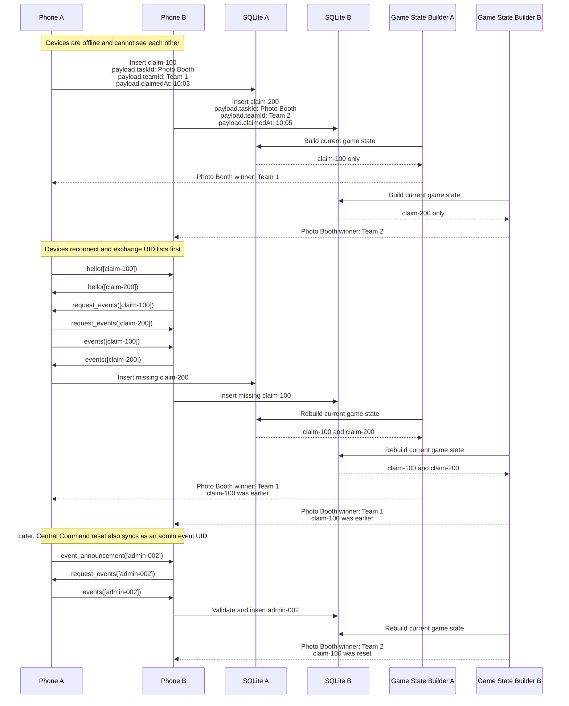
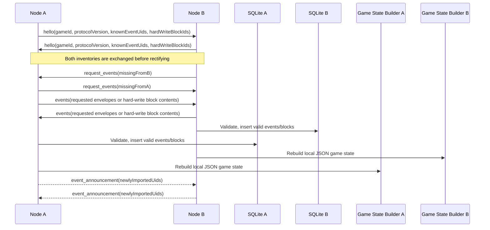
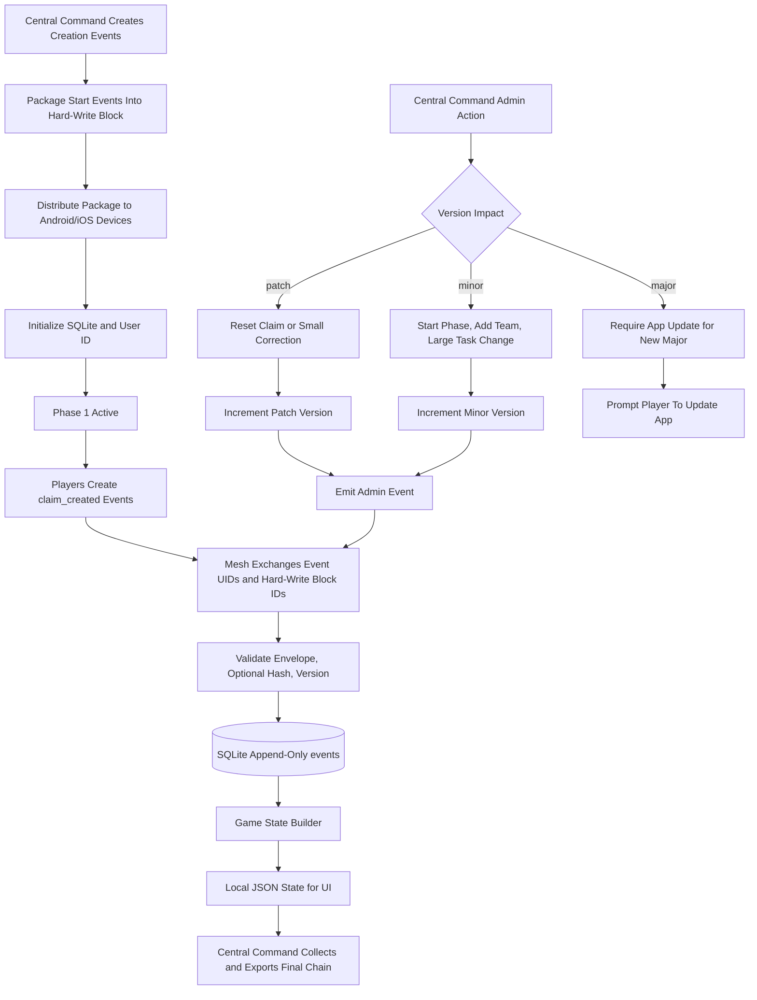

# HumanHaunt App Design Doc

## Overview

HumanHaunt is a mobile-first lockout game app for event settings where players may not have cell signal or reliable internet access. The mobile app will replicate the current gameplay from the Apps Script spike while replacing the sheet-backed server model with local-first storage and peer-to-peer propagation.

The production mobile app is intended to support both Android and iOS through the React Native app in `mobile/`.

Players choose a team, view a shared list of tasks, and claim tasks for points. Claims and admin changes are exchanged between nearby devices over an offline mesh protocol modeled after the relay behavior of bitchat. Each device keeps its own SQLite copy of the game state and converges with other devices by exchanging event identifiers and requesting missing events.

The repository currently contains:

- `apps-script/`: the Google Apps Script spike backed by a Google Sheet.
- `mobile/`: a React Native skeleton using SQLite for local state and a simple peer sync service.

## Goals

- Show players a pre-seeded task list.
- Support multi-phase events where each phase releases a new list of tasks.
- Carry unclaimed tasks from previous phases forward with increased point value.
- Let a player select the team they are playing for.
- Let a team claim an open task and receive the task's points.
- Optionally hide exact task point values while still showing current team rankings.
- Group tasks into categories for easier navigation.
- Provide task search by task description.
- Preserve lockout behavior: only one team should win a task in the derived game state.
- Work with no cell signal and no central internet service.
- Propagate claim and admin events through nearby devices using an offline mesh.
- Store the full local event chain in SQLite on every node.
- Synchronize missing claim and admin events during node handshakes.
- Support a dedicated Central Command app that creates admin packages.
- Propagate admin packages through the same mesh/event-chain mechanism.
- Allow admins to add tasks, reset false claims, rename teams, and perform other game operations.

## Non-Goals

- Real-time global consistency. Devices may temporarily disagree until mesh sync catches up.
- A traditional cloud backend for gameplay during the event.
- Strong identity proof for ordinary player devices in the first version.
- A full anti-cheat system in the first version.
- Preserving the Google Sheet as the production source of truth.
- Cryptographic signatures for admin or claim events in the first version.

## Current Spike Behavior

The Apps Script spike models a lockout sheet with:

- A `Task` column.
- A `Points` column.
- One column per team.
- A claim button for each open task.
- First-write-wins locking through `LockService`.
- Team selection through large team buttons.
- Admin UI for adding, editing, deleting, resetting tasks, and renaming teams.

The mobile app should preserve the user-visible behavior, but its source of truth will be event-derived local state instead of live sheet cells.

## Product Surfaces

### Mobile Player App

The mobile app is used by players during the game.

Primary responsibilities:

- Initialize a game package with tasks, teams, and settings.
- Let the user choose their team.
- Display tasks, claim status, and score totals.
- Display task categories, task search, active phase context, and team rankings.
- Create local claim events.
- Store events in SQLite.
- Sync claim and admin events with nearby peers.
- Rebuild task winners and scores from the local event chain into a local state document.

### Central Command App

Central Command is used by game hosts/admins.

Primary responsibilities:

- Create the initial game package as a block of creation events.
- Create admin packages during the event.
- Participate in the mesh to inject admin packages and collect game state.
- Issue hard-write blocks to compact old event UIDs for faster handshakes.
- Emit game-end and collection-window events.
- Optionally export the final event chain after the event.

Central Command can be implemented as a separate app surface after the mobile event model is stable. It may eventually be a React Native admin mode, desktop app, or local web app, but it should use the same event schema and validation rules.

## Architecture

HumanHaunt should be local-first and event-sourced.

High-level components:

- UI layer: React Native screens and components for team selection, tasks, scores, sync status, and admin status.
- Game state builder: pure logic that walks the event log in order and produces a local JSON state document for the UI.
- Persistence layer: SQLite tables for games, teams, tasks, users, events, sync state, hard-write blocks, and peer metadata.
- Mesh transport layer: peer discovery, connection management, relaying, handshakes, and missing-event requests.
- Admin package layer: Central Command admin events and validation rules.

The app should avoid treating mutable task rows as the source of truth. Mutable views should be built from the event log. Seed tables such as `games`, `teams`, `tasks`, `phases`, and `categories` are materialized projections of that log, not an independent source of truth.



## Data Model

The existing mobile schema already includes `games`, `teams`, `tasks`, `devices`, `claim_events`, and `sync_state`. The production model should extend this into a single event-chain model so claim events and admin packages can sync through the same protocol. Originating nodes should be identified by user ID rather than device ID.

Recommended core tables:

### `games`

- `id`
- `name`
- `created_at`
- `active`
- `current_game_version`

### `teams`

- `id`
- `game_id`
- `name`
- `color`
- `sort_order`
- `active`

### `tasks`

- `id`
- `game_id`
- `phase_id`
- `category_id`
- `title`
- `base_points`
- `current_points`
- `points_visible`
- `sort_order`
- `active`
- `created_by_event_id`
- `updated_by_event_id`

The production model should distinguish base points from current points so unclaimed tasks can become more valuable in later phases.

### `phases`

- `id`
- `game_id`
- `name`
- `sort_order`
- `starts_at`
- `ends_at`
- `active`
- `created_by_event_id`

### `task_categories`

- `id`
- `game_id`
- `name`
- `sort_order`
- `color`
- `active`

### `users`

- `id`
- `name`
- `created_at`
- `last_seen_at`

### `events`

This should become the canonical append-only chain.

- `id`: globally unique event UID.
- `game_id`
- `game_version`: version of the game rules/data the event was created against.
- `type`: `claim_created`, `admin_task_added`, `admin_task_updated`, `admin_task_deleted`, `admin_claim_reset`, `admin_team_renamed`, `admin_game_ended`, `admin_hard_write`, etc.
- `created_at`: sender timestamp.
- `received_at`: local ingest timestamp.
- `user_id`: originating user/node.
- `payload_json`: typed event-specific payload.
- `hash`: optional canonical hash of the event body for quick validation. Not required for v1 correctness, but useful when present.
- `source`: `local`, `peer`, `seed`, or `admin`.

### `hard_write_blocks`

Compact references issued by Central Command so handshakes can exchange one block ID instead of many old event UIDs.

- `id`: block UID announced during handshakes.
- `game_id`
- `created_at`
- `event_ids_json`: the event UIDs covered by the block.
- `source_event_id`: the admin hard-write event that created the block.

### `event_receipts`

Optional but useful later for diagnostics.

- `event_id`
- `peer_id`
- `first_seen_at`
- `last_seen_at`

### `sync_state`

- `peer_id`
- `peer_name`
- `last_seen_at`
- `last_event_count`
- `last_handshake_at`

`last_handshake_at` should be surfaced in the player UI as the last time the device successfully connected and completed a handshake with the mesh/network.

## Event Types

All events should use the same top-level envelope so storage, hashing, and mesh routing can treat claim events and admin events uniformly. Event-specific data belongs in `payload`.

Example envelope:

```json
{
  "id": "event-uid",
  "type": "claim_created",
  "gameId": "human-haunt-2026",
  "gameVersion": "1.2.3",
  "createdAt": 1784131200000,
  "userId": "user-a",
  "hash": "...",
  "payload": {}
}
```

### Claim Event

A claim event records a team claiming a task.

Example:

```json
{
  "id": "claim-100",
  "type": "claim_created",
  "gameId": "human-haunt-2026",
  "gameVersion": "1.2.3",
  "createdAt": 1784131200000,
  "userId": "user-a",
  "hash": "...",
  "payload": {
    "taskId": "task-biff-lime",
    "teamId": "team-1",
    "claimedAt": 1784131200000
  }
}
```

Validation rules:

- `payload.taskId` must reference a known active task at the time the event is applied.
- `payload.teamId` must reference a known active team.
- Envelope `gameVersion` must match the current active game version on the device when the claim is created.
- Duplicate event IDs are ignored.
- If multiple teams claim the same task, the derived winner is the earliest valid claim by `claimedAt`, with event ID as the deterministic tie-breaker.

Open decision: what happens when a team is removed after claims exist for that team? Options include keeping historical claims and scores, reassigning, or invalidating those claims. This needs an explicit rule before team-removal admin events ship.

### Admin Package

An admin package is an event created by Central Command. It uses the same mesh propagation mechanics as claim events.

Each admin package envelope includes the game version it produces. When Central Command pushes an admin change, it increments the game version and emits the resulting admin event.

Payload examples:

- Add task: `{ "taskId": "...", "title": "...", "basePoints": 10, "sortOrder": 12 }`
- Reset claim: `{ "taskId": "...", "claimEventId": "...", "reason": "false claim" }`
- Rename team: `{ "teamId": "...", "name": "Team Ghost" }`
- Delete task: `{ "taskId": "..." }`
- Start phase: `{ "phaseId": "...", "boostUnclaimedBy": 5 }`
- Add category: `{ "categoryId": "...", "name": "Photo Tasks", "sortOrder": 1 }`
- Game end: `{ "endedAt": 1784135000000, "collectionEndsAt": 1784136800000 }`
- Hard write: `{ "blockId": "...", "eventIds": ["claim-001", "claim-002"] }`

Validation rules:

- Admin events must include the resulting `gameVersion`.
- Admin reset events should not delete historical claims. Instead, they should mark a specific claim event as invalid when building the current game state.
- Admin event ordering should be deterministic. Prefer `created_at`, then event ID.

### Game Start Package

Game initialization should be a series of individual creation events (teams, categories, phases, tasks, settings), not one giant opaque start payload. Those creation events can be packaged into a hard-write block so devices import the whole start set as one compact unit during setup or first sync.

If a single start snapshot is ever used instead, it must use the same structure as the local JSON game-state document so the Game State Builder can treat it as an equivalent projection.

### Game End and Collection Window

`admin_game_ended` is a specific admin event.

Expected behavior:

1. Central Command emits `admin_game_ended` with an end timestamp and a collection window end time.
2. During the collection window, devices continue mesh sync so claims that occurred before game end can still propagate.
3. Claims with `claimedAt` after the game-end timestamp are ignored by the Game State Builder.
4. When the collection window expires, Central Command issues a hard-write block covering the final accepted event set for that match.
5. After that hard write, handshakes can exchange the final block ID instead of the full historical UID list.

## Game Versioning

Game version is not the same thing as app version.

- **Game version** (`major.minor.patch`) tracks rules and content changes for a match. Central Command owns game-version advancement.
- **App version** is the installed mobile client version. When the app's supported major game version increases, that major bump is used to detect outdated clients.

A player whose installed app cannot support the active match's major game version should be told to update to the latest app before they can participate. Devices should not try to merge incompatible major versions into an already running match.

Claim events should also include the current `gameVersion`. This makes later reconciliation and host review easier because each claim can be tied to the game rules and task list visible to the player when the claim was made.

### Major Admin Actions

Major version increments are full redeployments of the game and/or incompatible app/game code.

Expected behavior:

- Example increment: `1.4.2` to `2.0.0`.
- Devices that cannot support the new major version should prompt the user to update the app before joining or continuing in the active game.
- Existing claims and admin events should remain attached to the previous major version for audit/export.

### Minor Admin Actions

Minor version increments are admin changes with dramatic impact on the player base or game structure.

Expected behavior:

- Example increment: `1.4.2` to `1.5.0`.
- Adding or removing a team is a minor version change.
- Large task-list changes, scoring model changes, or other changes that alter player strategy should also be minor version changes.
- Starting a new phase is usually a minor version change.
- Adding or removing task categories can be a minor version change if it changes how players navigate or understand the game.
- Devices may apply minor changes during a running match, but the UI should make the version change visible because players may see materially different game state afterward.

### Patch Admin Actions

Patch version increments are small operational corrections.

Expected behavior:

- Example increment: `1.4.2` to `1.4.3`.
- Resetting a false claim is a patch version change.
- Correcting a typo, adjusting a task description, or making a small task correction can be a patch version change if it does not materially alter player strategy.
- Small category label corrections can be a patch version change.
- Patch changes should propagate through the mesh and rebuild current game state without requiring a match restart.

## Phases, Rankings, and Task Discovery

HumanHaunt should support events that span multiple phases. A phase is a time-boxed or host-triggered segment of the game with its own newly released tasks.

### Phase Behavior

- Each phase can release a new list of possible tasks.
- Tasks from earlier phases remain visible if they were not claimed.
- Unclaimed tasks from previous phases should carry forward with increased `current_points`.
- Claimed tasks stay claimed when the phase changes unless an admin package resets the claim.
- Claimed tasks should be grayed out in the UI and moved into a dedicated `Completed` category.
- Phase changes should be admin events so they propagate through the mesh and are included in the event chain.
- Starting a new phase should increment the game version. In most cases this should be a minor version change because the available task pool and team strategy are materially affected.

### Hidden Point Values and Rankings

The app may hide exact task point values from players while still showing current team rankings.

Expected behavior:

- The game state builder should always calculate scores from actual `current_points`.
- The player UI can hide exact point values when `points_visible` is false.
- The UI should still show team rank order and relative standing.
- Central Command should always be able to view actual point values and final score calculations.

### Task Categories

Tasks should be grouped into categories in the UI for easier navigation.

Examples:

- Photo tasks
- Location tasks
- Social tasks
- Bonus tasks
- Phase-specific tasks
- Completed

`Completed` is a system category for claimed tasks. Other categories should be part of the game package and mutable through admin events when needed.

### Task Search

The mobile app should provide offline task search against local SQLite/state.

Search should match task description/title text only. Category filters and hint text are out of scope for v1 search.

## Event Chain

The event chain is the set of event UIDs and event bodies known to a node. An event UID can identify a claim event, an admin event, or a hard-write block reference. The chain is append-only at storage time. Current UI state is derived by replaying those events in deterministic order.

Every node stores:

- A UID list for all known events and hard-write blocks.
- Full event bodies for locally created and imported events.
- A locally built JSON game-state document containing tasks, winners, scores, and rankings.

### Game State Builder

Each device keeps an internal JSON document representing the current game state. The Game State Builder constructs that document by iterating every known event in deterministic order and applying each event to an in-memory state object. The UI reads from the resulting state document, not directly from ad hoc SQL joins over mutable rows.

Practical rules:

- Prefer full replay into a new state document when events arrive or when reconciliation is uncertain.
- Expose a manual "Rebuild state" action so hosts/players can force a clean replay if incremental reconciliation goes wrong.
- Incremental/vector-style updates are optional later optimizations. If incremental apply is used, every applied action still needs a well-defined way to recompute equivalent state from a full replay; full rebuild remains the source of truth.
- The initial start package is a block of creation events that the builder applies like any other events.

### Conflict Handling

Offline devices can create claims before they hear about each other. That is expected.

When two devices later sync:

1. Both claim events are kept in the append-only event log.
2. Neither claim is deleted just because a conflict exists.
3. The Game State Builder chooses one winner with deterministic rules: earliest valid `claimedAt`, then lexicographic event ID.
4. Later admin resets can invalidate a specific claim; the builder then chooses the next earliest valid claim or reopens the task.

So the log stores history, and the state document stores the current interpretation of that history.

Example event chain:

```json
[
  {
    "id": "admin-team-1",
    "type": "admin_team_added",
    "gameId": "human-haunt-2026",
    "gameVersion": "1.0.0",
    "createdAt": 1784130000000,
    "userId": "central-command",
    "hash": "hash-admin-team-1",
    "payload": {
      "teamId": "team-1",
      "name": "Team 1",
      "color": "#111111",
      "sortOrder": 1
    }
  },
  {
    "id": "admin-task-photo",
    "type": "admin_task_added",
    "gameId": "human-haunt-2026",
    "gameVersion": "1.0.0",
    "createdAt": 1784130001000,
    "userId": "central-command",
    "hash": "hash-admin-task-photo",
    "payload": {
      "taskId": "task-photo-booth",
      "title": "Photo Booth",
      "basePoints": 10,
      "sortOrder": 1
    }
  },
  {
    "id": "claim-100",
    "type": "claim_created",
    "gameId": "human-haunt-2026",
    "gameVersion": "1.0.0",
    "createdAt": 1784131200000,
    "userId": "user-a",
    "hash": "hash-claim-100",
    "payload": {
      "taskId": "task-photo-booth",
      "teamId": "team-1",
      "claimedAt": 1784131200000
    }
  },
  {
    "id": "claim-200",
    "type": "claim_created",
    "gameId": "human-haunt-2026",
    "gameVersion": "1.0.0",
    "createdAt": 1784131320000,
    "userId": "user-b",
    "hash": "hash-claim-200",
    "payload": {
      "taskId": "task-photo-booth",
      "teamId": "team-2",
      "claimedAt": 1784131320000
    }
  },
  {
    "id": "admin-002",
    "type": "admin_claim_reset",
    "gameId": "human-haunt-2026",
    "gameVersion": "1.0.1",
    "createdAt": 1784132400000,
    "userId": "central-command",
    "hash": "hash-admin-002",
    "payload": {
      "taskId": "task-photo-booth",
      "claimEventId": "claim-100",
      "reason": "false claim"
    }
  }
]
```

In this chain, `claim-100` initially wins because it is earlier than `claim-200`. After `admin-002` is applied, `claim-100` is invalidated and the Game State Builder chooses `claim-200` as the current winner. The claim events remain in the chain for audit history.



### Reconciliation Example

In this example, two devices are offline and both claim the same task. When they later connect, neither event is deleted. Both devices store both claim events, then the Game State Builder applies the same deterministic rules and chooses the earliest valid claim as the winner.



## Hard Writes

To keep handshakes small, Central Command can hard-write a group of older event IDs into one block ID.

Example use cases:

- Compact claims from the previous day or previous phase.
- Package the initial creation-event set.
- Seal the final accepted event set after the game-end collection window.

Behavior:

1. Central Command selects a set of already-accepted event UIDs.
2. Central Command emits an `admin_hard_write` event with a new `blockId` and the covered `eventIds`.
3. Devices that receive the hard-write event store the block mapping and can announce the block ID in future handshakes instead of every covered UID.
4. When a peer is missing a hard-write block, it requests the block contents and runs a full validation/claim check over the contained events at ingestion time.
5. After a block is known, handshake UID lists may include the block ID plus any events newer than that block.

Hard writes do not delete history. They create a compact sync alias for a known event set.

## Mesh Sync Protocol

The current skeleton has a TCP peer sync that sends all claim events to connected peers. The production protocol should evolve toward UID-based delta exchange for both claim events and admin events, with hard-write block IDs as compact aliases for older ranges.

### Handshake

When two nodes connect, they should exchange UID inventories before applying missing events. That gives both sides a shorter round-trip to learn what the other already has.

Recommended order:

1. Node A sends `hello` with user/device metadata, game ID, protocol version, known event UIDs, and known hard-write block IDs.
2. Node B immediately replies with its own `hello` inventory before requesting or importing events.
3. Each node diffs the peer inventory against its local inventory.
4. Each node sends `request_events` for UIDs/blocks it is missing.
5. Peers respond with `events` payloads for requested UIDs/blocks.
6. Both nodes validate and import missing events, update `last_handshake_at`, and rebuild local game state.
7. Newly imported valid events are relayed to other connected peers that have not announced those UIDs.



### Relay

Relay is required for multi-hop propagation and should be treated as a first-class part of the protocol, not only a handshake footnote.

Relay rules:

- After a node imports a valid new event or hard-write block, it announces that UID/block to its other connected peers.
- Peers that already know the UID acknowledge or ignore the announcement.
- Peers that are missing the UID send `request_events` and import it normally.
- Never relay events that fail validation.
- Insert events idempotently by UID.
- Limit message size by chunking UID lists, hard-write block contents, and event payloads.
- Keep transport independent from domain rules so Bluetooth, Wi-Fi Direct, local TCP, or another bearer can be swapped in later.

### Message Types

Recommended starting message set:

- `hello`: user metadata, game ID, protocol version, event UID list and/or hard-write block IDs.
- `request_events`: event UID / hard-write block ID list requested from a peer.
- `events`: full event bodies or hard-write block contents.
- `event_announcement`: newly available event UIDs or hard-write block IDs.
- `admin_announcement`: optional high-priority admin event announcement.
- `error`: protocol or validation failure.

## Offline and Consistency Model

HumanHaunt is eventually consistent.

Expected behavior:

- A phone can create a claim with no network connection.
- Nearby phones may not see the claim immediately.
- When phones connect, they exchange inventories first, then missing events.
- Each phone rebuilds winners and scores from the same deterministic rules.
- Once all devices have the same valid event set, they show the same game state.

The UI should communicate sync status clearly, including `last_handshake_at`. A task can show that a local claim is pending mesh propagation, and conflict notices can explain when multiple claims exist but only the earliest valid claim wins.

## Security Model

First version:

- Claim events and admin events are trusted enough for gameplay and auditable after the fact.
- Cryptographic signatures are out of scope for v1.
- Event IDs and optional hashes help detect accidental duplication and make some forms of tampering visible during host review.

## Central Command Flow

### Before the Game

1. Host creates a game package as individual creation events for tasks, teams, points, colors, phases, and categories.
2. Those creation events are packaged into a hard-write block for efficient distribution.
3. Player devices import the package before entering the no-signal environment.
4. Each device creates or loads its local user ID.
5. Each device initializes SQLite and builds the initial JSON game-state document.

### During the Game

1. Players claim tasks locally.
2. Devices exchange claim and admin events through the mesh, including relay to multi-hop peers.
3. Central Command creates admin events as needed and increments the game version.
4. Central Command may hard-write older event groups to keep handshakes small.
5. Devices validate admin events, record the new game version, and rebuild their current game state.



### After the Game

1. Central Command emits `admin_game_ended` and keeps the collection window open.
2. Devices continue syncing claims that occurred before game end.
3. When the collection window closes, Central Command hard-writes the final accepted event set.
4. Hosts inspect conflicts, invalidated claims, and final scores.
5. The final chain can be exported as JSON or CSV.

## Implementation Plan

### Phase 1: Match the Spike Locally

- Ensure points exist on the mobile task model and SQLite schema.
- Add score totals to the mobile UI.
- Add explicit team selection instead of claim buttons for every team.
- Add task categories, including a `Completed` category for claimed tasks.
- Add task-description search to the mobile UI.
- Preserve first-claim-wins behavior in the game state builder.
- Keep the current simple peer sync as a development aid.

### Phase 2: Event Chain Unification

- Replace `claim_events`-only sync with a generic `events` table keyed by user ID.
- Represent claim events and admin packages with a common envelope.
- Store a local JSON game-state document produced by replaying events.
- Add a manual rebuild-state action.
- Add deterministic validation and conflict resolution tests.

### Phase 3: UID-Based Mesh Sync

- Change handshakes to exchange inventories first, then request missing UIDs.
- Add missing-event requests.
- Add event announcements and multi-hop relaying.
- Add hard-write blocks for compact sync of older event groups.
- Track peer sync metadata, including `last_handshake_at`, in SQLite.

### Phase 4: Central Command Admin Packages

- Define admin event schemas, including game end and hard write.
- Implement task add/update/delete, phase start, category update, team rename, and claim reset behavior in the game state builder.
- Add host-facing export/import tooling.

### Phase 5: Multi-Phase Gameplay

- Add phase scheduling or host-triggered phase start behavior.
- Carry unclaimed tasks forward into later phases.
- Increase `current_points` for unclaimed tasks from previous phases.
- Gray out claimed tasks and move them into `Completed`.
- Add hidden-point display mode while preserving team rankings.
- Add Central Command controls for phase release and point visibility.

### Phase 6: Production Hardening

- Decide the production mesh bearer for Android and iOS.
- Add reconnect, retry, and backoff behavior.
- Add protocol versioning.
- Add migration strategy for SQLite schema changes.
- Add test fixtures for multi-device conflict scenarios.
- Add event log diagnostics for hosts.

## Testing Strategy

- Domain unit tests for claim ordering, score totals, rankings, phase rollover, task resets, task admin events, hard-write ingestion, game-end collection windows, and invalid event handling.
- SQLite tests for migrations, idempotent imports, task-description search, and current-state queries.
- Protocol tests for inventory-first handshake diffing, missing UID requests, hard-write block exchange, duplicate imports, and relay behavior.
- Device/manual tests with at least three phones to verify multi-hop propagation.
- State rebuild tests proving full replay matches the UI state document after conflicts and admin resets.

## Open Questions

- What mesh bearer should be used first for the no-signal environment: Bluetooth LE, Wi-Fi Direct, local Wi-Fi TCP, or a hybrid?
- Should Central Command be a separate app, an admin mode in the React Native app, or a desktop/local web app?
- How will devices receive the initial game package: QR code, file import, local network, or pre-bundled seed data?
- Should claim ordering use device timestamps only, or should Central Command/admin review have the final say for close conflicts?
- How large can the game get in expected use: task count, player count, team count, and event count?
- Should phases start at scheduled times, by Central Command action, or both?
- How much should unclaimed task point values increase between phases?
- Should players see exact score totals, rank order only, or a hybrid display?
- What happens to existing claims and scores when a team is removed mid-game?
