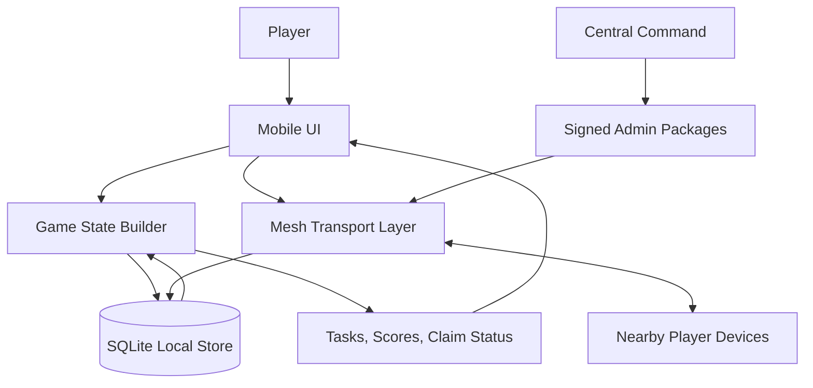
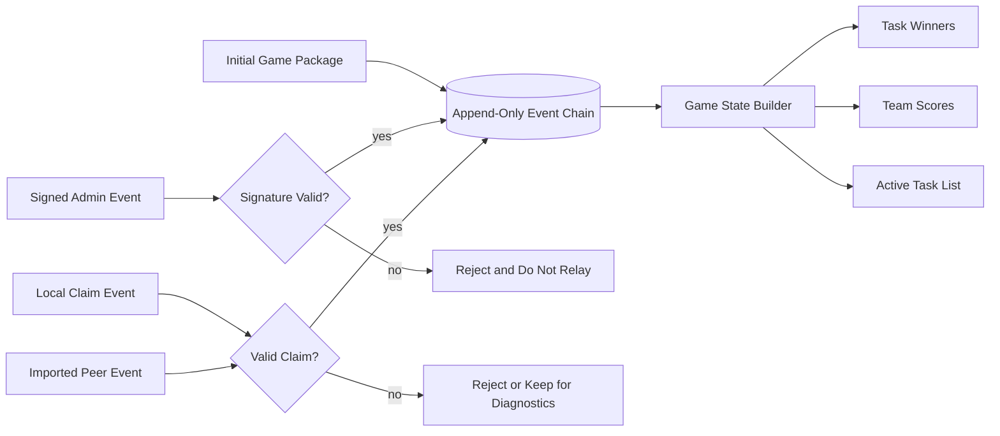
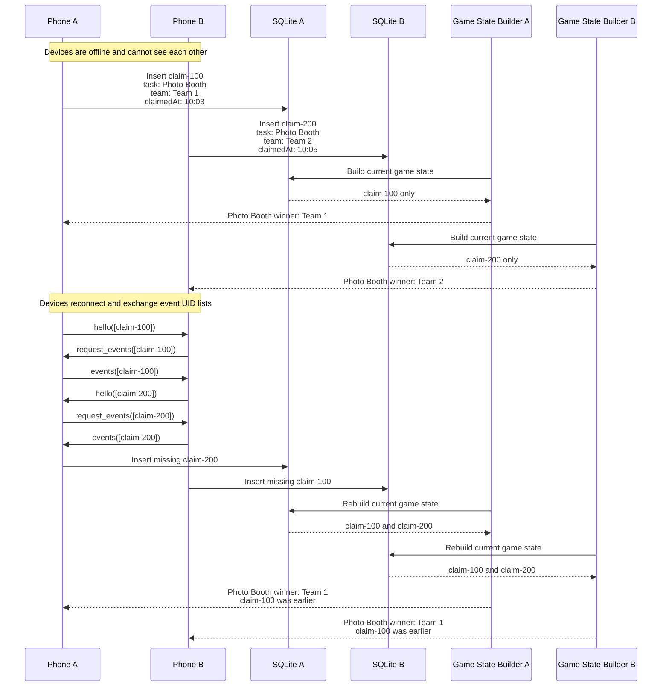
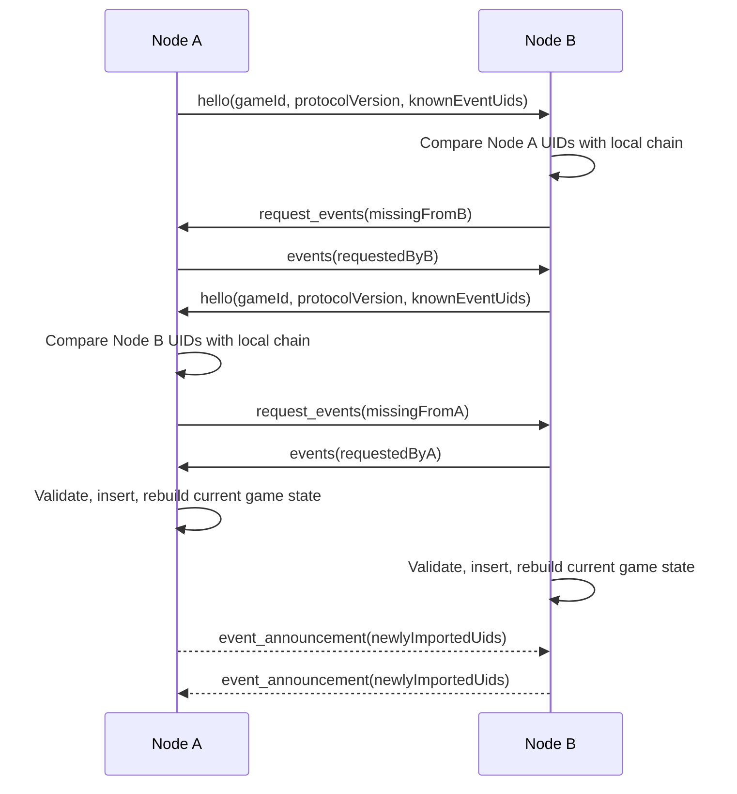
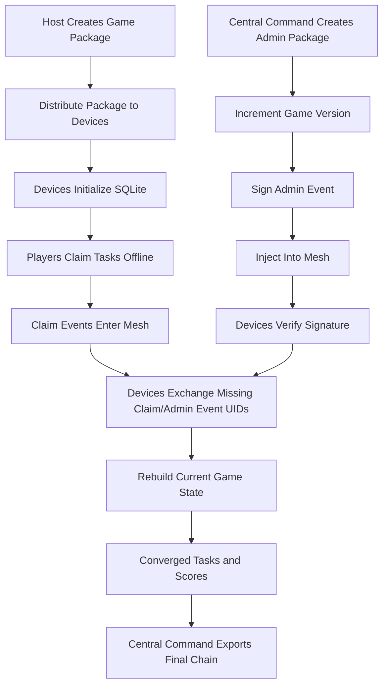

# HumanHaunt App Design Doc

## Overview

HumanHaunt is a mobile-first lockout game app for event settings where players may not have cell signal or reliable internet access. The mobile app will replicate the current gameplay from the Apps Script spike while replacing the sheet-backed server model with local-first storage and peer-to-peer propagation.

The production mobile app is intended to support both Android and iOS through the React Native app in `mobile/`.

Players choose a team, view a shared list of tasks, and claim tasks for points. Claims and admin changes are exchanged between nearby devices over an offline mesh protocol modeled after the relay behavior of bitchat. Each device keeps its own SQLite copy of the game state and converges with other devices by exchanging event identifiers and requesting missing events.

The repository currently contains:

- `apps-script/`: the Google Apps Script spike backed by a Google Sheet.
- `mobile/`: a React Native skeleton using SQLite for local state and a simple peer sync service.

## Goals

- Show players a pre-seeded task list.
- Support multi-phase events where each phase releases a new list of tasks.
- Carry unclaimed tasks from previous phases forward with increased point value.
- Let a player select the team they are playing for.
- Let a team claim an open task and receive the task's points.
- Optionally hide exact task point values while still showing current team rankings.
- Group tasks into categories for easier navigation.
- Provide task search.
- Preserve lockout behavior: only one team should win a task in the derived game state.
- Work with no cell signal and no central internet service.
- Propagate claim and admin events through nearby devices using an offline mesh.
- Store the full local event chain in SQLite on every node.
- Synchronize missing claim and admin events during node handshakes.
- Support a dedicated Central Command app that creates signed admin packages.
- Propagate admin packages through the same mesh/event-chain mechanism.
- Allow admins to add tasks, reset false claims, rename teams, and perform other game operations.

## Non-Goals

- Real-time global consistency. Devices may temporarily disagree until mesh sync catches up.
- A traditional cloud backend for gameplay during the event.
- Strong identity proof for ordinary player devices in the first version.
- A full anti-cheat system in the first version.
- Preserving the Google Sheet as the production source of truth.

## Current Spike Behavior

The Apps Script spike models a lockout sheet with:

- A `Task` column.
- A `Points` column.
- One column per team.
- A claim button for each open task.
- First-write-wins locking through `LockService`.
- Team selection through large team buttons.
- Admin UI for adding, editing, deleting, resetting tasks, and renaming teams.

The mobile app should preserve the user-visible behavior, but its source of truth will be event-derived local state instead of live sheet cells.

## Product Surfaces

### Mobile Player App

The mobile app is used by players during the game.

Primary responsibilities:

- Initialize a game package with tasks, teams, and settings.
- Let the user choose their team.
- Display tasks, claim status, and score totals.
- Display task categories, task search, active phase context, and team rankings.
- Create local claim events.
- Store events in SQLite.
- Sync claim and admin events with nearby peers.
- Recompute task winners and scores from the local event chain.

### Central Command App

Central Command is used by game hosts/admins.

Primary responsibilities:

- Create the initial game package.
- Create admin packages during the event.
- Sign admin packages so player devices can verify they came from Central Command.
- Participate in the mesh to inject admin packages and collect game state.
- Optionally export the final event chain after the event.

Central Command can be implemented as a separate app surface after the mobile event model is stable. It may eventually be a React Native admin mode, desktop app, or local web app, but it should use the same event schema and verification rules.

## Architecture

HumanHaunt should be local-first and event-sourced.

High-level components:

- UI layer: React Native screens and components for team selection, tasks, scores, sync status, and admin status.
- Game state builder: pure logic for deriving winners, scores, active task lists, and conflict resolution from events.
- Persistence layer: SQLite tables for games, teams, tasks, devices, events, sync state, and peer metadata.
- Mesh transport layer: peer discovery, connection management, relaying, handshakes, and missing-event requests.
- Admin package layer: signed admin events and validation rules.

The app should avoid treating mutable task rows as the source of truth. Mutable views should be built from the event log plus the initial game package.



## Data Model

The existing mobile schema already includes `games`, `teams`, `tasks`, `devices`, `claim_events`, and `sync_state`. The production model should extend this into a single event-chain model so claim events and admin packages can sync through the same protocol.

Recommended core tables:

### `games`

- `id`
- `name`
- `created_at`
- `active`

### `teams`

- `id`
- `game_id`
- `name`
- `color`
- `sort_order`
- `active`

### `tasks`

- `id`
- `game_id`
- `phase_id`
- `category_id`
- `title`
- `base_points`
- `current_points`
- `points_visible`
- `sort_order`
- `active`
- `created_by_event_id`
- `updated_by_event_id`

The current mobile `Task` type does not include points yet. Points should be added before score totals are treated as complete. The production model should distinguish base points from current points so unclaimed tasks can become more valuable in later phases.

### `phases`

- `id`
- `game_id`
- `name`
- `sort_order`
- `starts_at`
- `ends_at`
- `active`
- `created_by_event_id`

### `task_categories`

- `id`
- `game_id`
- `name`
- `sort_order`
- `color`
- `active`

### `devices`

- `id`
- `name`
- `created_at`
- `last_seen_at`

### `events`

This should become the canonical append-only chain.

- `id`: globally unique event UID.
- `game_id`
- `game_version`: version of the game rules/data the event was created against.
- `type`: `claim_created`, `admin_task_added`, `admin_task_updated`, `admin_task_deleted`, `admin_claim_reset`, `admin_team_renamed`, etc.
- `created_at`: sender timestamp.
- `received_at`: local ingest timestamp.
- `device_id`: originating node.
- `team_id`: optional, required for player claim events.
- `payload_json`: typed payload.
- `signature`: optional for player claims, required for admin events.
- `hash`: canonical hash of the event body.
- `previous_hash`: optional link for events created by the same origin.
- `source`: `local`, `peer`, `seed`, or `admin`.

### `event_receipts`

Optional but useful later for diagnostics.

- `event_id`
- `peer_id`
- `first_seen_at`
- `last_seen_at`

### `sync_state`

- `peer_id`
- `peer_name`
- `last_seen_at`
- `last_event_count`
- `last_handshake_at`

## Event Types

### Claim Event

A claim event records a team claiming a task.

Payload:

```json
{
  "taskId": "task-biff-lime",
  "teamId": "team-1",
  "gameVersion": "1.2.3",
  "claimedAt": 1784131200000
}
```

Validation rules:

- `taskId` must reference a known active task at the time the event is applied.
- `teamId` must reference a known active team.
- `gameVersion` must match the current active game version on the device when the claim is created.
- Duplicate event IDs are ignored.
- If multiple teams claim the same task, the derived winner is the earliest valid claim by `claimedAt`, with event ID as the deterministic tie-breaker.

### Admin Package

An admin package is an event created by Central Command. It uses the same mesh propagation mechanics as claim events but requires admin signature verification.

Each admin package includes the game version it produces. When Central Command pushes an admin change, it increments the game version and signs the resulting admin event.

Payload examples:

- Add task: `{ "gameVersion": "1.3.0", "taskId": "...", "title": "...", "points": 10, "sortOrder": 12 }`
- Reset claim: `{ "gameVersion": "1.2.4", "taskId": "...", "claimEventId": "...", "reason": "false claim" }`
- Rename team: `{ "gameVersion": "1.3.0", "teamId": "...", "name": "Team Ghost" }`
- Delete task: `{ "gameVersion": "1.3.0", "taskId": "..." }`
- Start phase: `{ "gameVersion": "1.4.0", "phaseId": "...", "boostUnclaimedBy": 5 }`
- Add category: `{ "gameVersion": "1.3.0", "categoryId": "...", "name": "Photo Tasks", "sortOrder": 1 }`

Validation rules:

- Admin events must be signed by a trusted Central Command key.
- Admin events must include the resulting `gameVersion`.
- Devices should ignore unsigned or invalidly signed admin events.
- Admin reset events should not delete historical claims. Instead, they should mark a specific claim event as invalid when building the current game state.
- Admin event ordering should be deterministic. Prefer `created_at`, then event ID, with a future option for admin sequence numbers.

## Game Versioning

Game versions should follow `major.minor.patch` semantics. Central Command owns version advancement, and every admin package should carry the resulting game version so player devices can understand which version of the game state produced each event.

Claim events should also include the current `gameVersion`. This makes later reconciliation and host review easier because each claim can be tied to the game rules and task list visible to the player when the claim was made.

### Major Admin Actions

Major version increments are full redeployments of the game and game code. A major version change should not be propagated into an actively running match as a normal mesh update.

Expected behavior:

- Example increment: `1.4.2` to `2.0.0`.
- Devices should treat the new major version as a different game deployment.
- Any actively running game/match should restart instead of attempting to merge the change into the existing event chain.
- Existing claims and admin events should remain attached to the previous major version for audit/export.

### Minor Admin Actions

Minor version increments are admin changes with dramatic impact on the player base or game structure.

Expected behavior:

- Example increment: `1.4.2` to `1.5.0`.
- Adding or removing a team is a minor version change.
- Large task-list changes, scoring model changes, or other changes that alter player strategy should also be minor version changes.
- Starting a new phase is usually a minor version change.
- Adding or removing task categories can be a minor version change if it changes how players navigate or understand the game.
- Devices may apply minor changes during a running match, but the UI should make the version change visible because players may see materially different game state afterward.

### Patch Admin Actions

Patch version increments are small operational corrections.

Expected behavior:

- Example increment: `1.4.2` to `1.4.3`.
- Resetting a false claim is a patch version change.
- Correcting a typo, adjusting a task description, or making a small task correction can be a patch version change if it does not materially alter player strategy.
- Small category label corrections can be a patch version change.
- Patch changes should propagate through the mesh and rebuild current game state without requiring a match restart.

## Phases, Rankings, and Task Discovery

HumanHaunt should support events that span multiple phases. A phase is a time-boxed or host-triggered segment of the game with its own newly released tasks.

### Phase Behavior

- Each phase can release a new list of possible tasks.
- Tasks from earlier phases remain visible if they were not claimed.
- Unclaimed tasks from previous phases should carry forward with increased `current_points`.
- Claimed tasks stay claimed when the phase changes unless an admin package resets the claim.
- Phase changes should be admin events so they propagate through the mesh and are included in the event chain.
- Starting a new phase should increment the game version. In most cases this should be a minor version change because the available task pool and team strategy are materially affected.

### Hidden Point Values and Rankings

The app may hide exact task point values from players while still showing current team rankings.

Expected behavior:

- The game state builder should always calculate scores from actual `current_points`.
- The player UI can hide exact point values when `points_visible` is false.
- The UI should still show team rank order and relative standing.
- Central Command should always be able to view actual point values and final score calculations.

### Task Categories

Tasks should be grouped into categories in the UI for easier navigation.

Examples:

- Photo tasks
- Location tasks
- Social tasks
- Bonus tasks
- Phase-specific tasks

Categories should be part of the game package and mutable through signed admin events when needed.

### Task Search

The mobile app should provide task search so players can quickly find tasks by title, category, phase, and possibly hint text.

Search should work entirely offline against the local SQLite state and should respect the same visibility rules as the main task list.

## Event Chain

The event chain is the set of event UIDs and event bodies known to a node. An event UID can identify either a claim event or an admin event. The chain is append-only at storage time and deterministic when building the current game state.

Every node stores:

- A UID list for all known events.
- Full event bodies for locally created and imported events.
- A locally built game state containing tasks, winners, and scores.

The chain may contain conflicting claims and later admin events that change how claims are interpreted. Conflicts are expected because devices can be offline and create claims before hearing about each other. Conflict resolution happens when deriving game state, not when inserting events.

Initial rule:

- For each task, the winning claim is the valid claim with the earliest `claimedAt`.
- Ties are resolved by lexicographic event ID.
- Admin reset events can invalidate a claim, causing the game state builder to choose the next earliest valid claim or reopen the task.



### Reconciliation Example

In this example, two devices are offline and both claim the same task. When they later connect, neither event is deleted. Both devices store both claim events, then the Game State Builder applies the same deterministic rules and chooses the earliest valid claim as the winner.



## Mesh Sync Protocol

The current skeleton has a TCP peer sync that sends all claim events to connected peers. The production protocol should evolve toward UID-based delta exchange for both claim events and admin events.

### Handshake

When two nodes connect:

1. Node A sends `hello` with device metadata, game ID, protocol version, and known event UIDs.
2. Node B compares A's UID list to its local UID list. Each UID may refer to a claim event or an admin event.
3. Node B sends `request_events` for UIDs it is missing.
4. Node B sends its own UID list or a compact summary.
5. Node A requests missing UIDs from B.
6. Both nodes import valid events and rebuild their current game state.
7. Newly imported events are relayed to connected peers.



### Message Types

Recommended starting message set:

- `hello`: device metadata, game ID, protocol version, event UID list or digest. Event UIDs may represent claim events or admin events.
- `request_events`: event UID list requested from a peer.
- `events`: full event bodies.
- `event_announcement`: newly available event UIDs.
- `admin_announcement`: optional high-priority admin event announcement.
- `error`: protocol or validation failure.

### Relay Rules

- Insert events idempotently by UID.
- Never relay events that fail validation.
- Relay newly imported valid events to peers that have not announced the UID.
- Limit message size by chunking UID lists and event payloads.
- Keep transport independent from domain rules so Bluetooth, Wi-Fi Direct, local TCP, or another bearer can be swapped in later.

## Offline and Consistency Model

HumanHaunt is eventually consistent.

Expected behavior:

- A phone can create a claim with no network connection.
- Nearby phones may not see the claim immediately.
- When phones connect, they exchange missing events.
- Each phone recomputes winners and scores from the same deterministic rules.
- Once all devices have the same valid event set, they show the same game state.

The UI should communicate sync status clearly. A task can show that a local claim is pending mesh propagation, and conflict notices can explain when multiple claims exist but only the earliest valid claim wins.

## Security Model

First version:

- Claim events are trusted enough for gameplay but auditable after the fact.
- Admin events must be signed by Central Command.
- Devices store the Central Command public key in the initial game package.
- Invalid signatures are rejected and not relayed.
- Event IDs and hashes prevent accidental duplication and make tampering visible.

Future hardening:

- Sign player claim events with per-device keys.
- Use QR or NFC enrollment for trusted devices.
- Add event hash chaining per origin device.
- Add admin sequence numbers to prevent replay of stale admin changes.
- Encrypt mesh payloads if game data or participant identity needs privacy.

## Central Command Flow

### Before the Game

1. Host creates a game package with tasks, teams, points, colors, and admin public key.
2. Player devices import the package before entering the no-signal environment.
3. Each device creates or loads its local device ID.
4. Each device initializes SQLite with the game package.

### During the Game

1. Players claim tasks locally.
2. Devices exchange claim and admin events through the mesh.
3. Central Command creates admin events as needed and increments the game version.
4. Admin events propagate through the mesh.
5. Devices verify admin signatures, record the new game version, and rebuild their current game state.



### After the Game

1. Central Command gathers event chains from nearby devices.
2. Hosts inspect conflicts, invalidated claims, and final scores.
3. The final chain can be exported as JSON or CSV.

## Implementation Plan

### Phase 1: Match the Spike Locally

- Add points to the mobile task model and SQLite schema.
- Add score totals to the mobile UI.
- Add explicit team selection instead of claim buttons for every team.
- Add task categories and task search to the mobile UI.
- Preserve first-claim-wins behavior in the game state builder.
- Keep the current simple peer sync as a development aid.

### Phase 2: Event Chain Unification

- Replace `claim_events`-only sync with a generic `events` table.
- Represent claim events and admin packages with a common envelope.
- Make the game state builder derive tasks, phases, categories, claims, resets, team names, rankings, and scores from events.
- Add deterministic validation and conflict resolution tests.

### Phase 3: UID-Based Mesh Sync

- Change handshakes to exchange event UID lists or digests.
- Add missing-event requests.
- Add event announcements and relaying.
- Add chunking for large chains.
- Track peer sync metadata in SQLite.

### Phase 4: Central Command Admin Packages

- Define admin event schemas.
- Add signing in Central Command.
- Add signature verification in the mobile app.
- Implement task add/update/delete, phase start, category update, team rename, and claim reset behavior in the game state builder.
- Add host-facing export/import tooling.

### Phase 5: Multi-Phase Gameplay

- Add phase scheduling or host-triggered phase start behavior.
- Carry unclaimed tasks forward into later phases.
- Increase `current_points` for unclaimed tasks from previous phases.
- Add hidden-point display mode while preserving team rankings.
- Add Central Command controls for phase release and point visibility.

### Phase 6: Production Hardening

- Decide the production mesh bearer for Android and iOS.
- Add reconnect, retry, and backoff behavior.
- Add protocol versioning.
- Add migration strategy for SQLite schema changes.
- Add test fixtures for multi-device conflict scenarios.
- Add event log diagnostics for hosts.

## Testing Strategy

- Domain unit tests for claim ordering, score totals, rankings, phase rollover, task resets, task admin events, and invalid event handling.
- SQLite tests for migrations, idempotent imports, task search, and current-state queries.
- Protocol tests for handshake diffing, missing UID requests, duplicate imports, and relay behavior.
- Device/manual tests with at least three phones to verify multi-hop propagation.
- Admin package tests for valid signatures, invalid signatures, replay attempts, and reset behavior.

## Open Questions

- What mesh bearer should be used first for the no-signal environment: Bluetooth LE, Wi-Fi Direct, local Wi-Fi TCP, or a hybrid?
- Should Central Command be a separate app, an admin mode in the React Native app, or a desktop/local web app?
- How will devices receive the initial game package: QR code, file import, local network, or pre-bundled seed data?
- Do player claim events need signatures in the first playable version?
- Should claim ordering use device timestamps only, or should Central Command/admin review have the final say for close conflicts?
- How large can the game get in expected use: task count, player count, team count, and event count?
- Should phases start at scheduled times, by Central Command action, or both?
- How much should unclaimed task point values increase between phases?
- Should players see exact score totals, rank order only, or a hybrid display?

